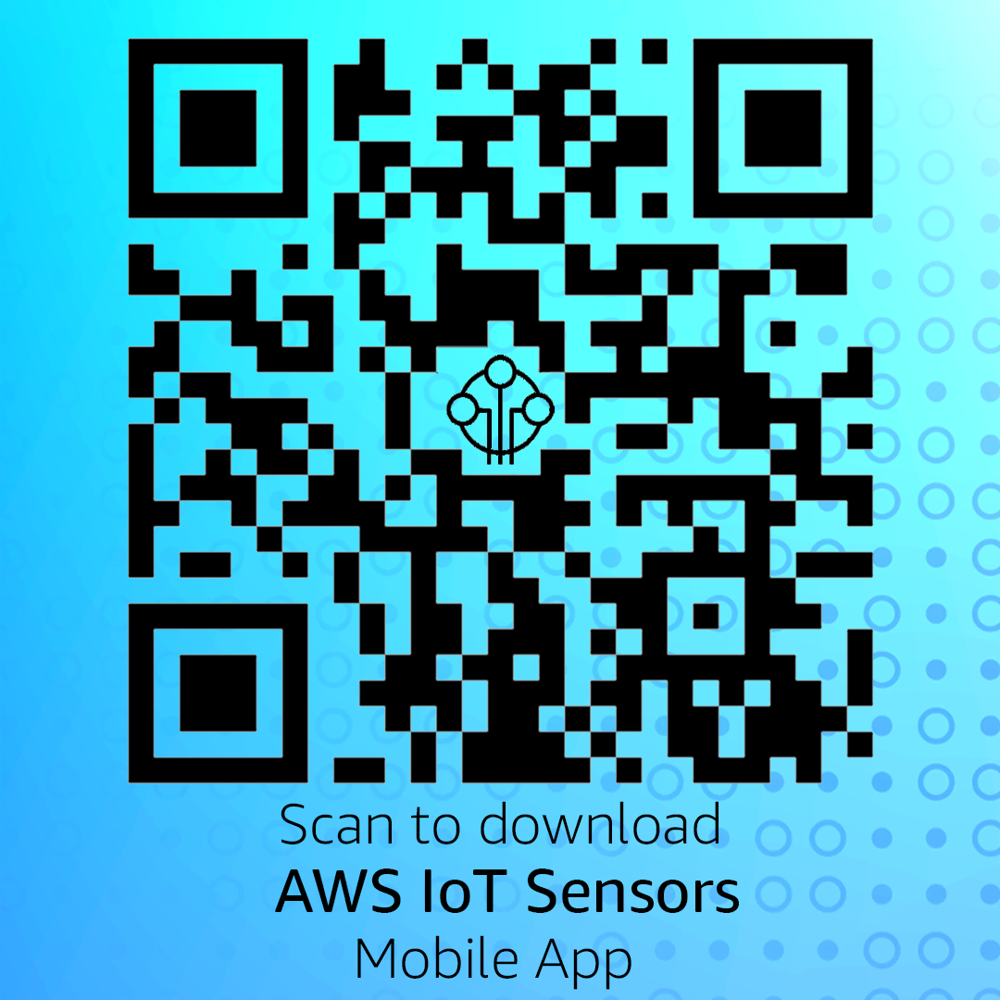
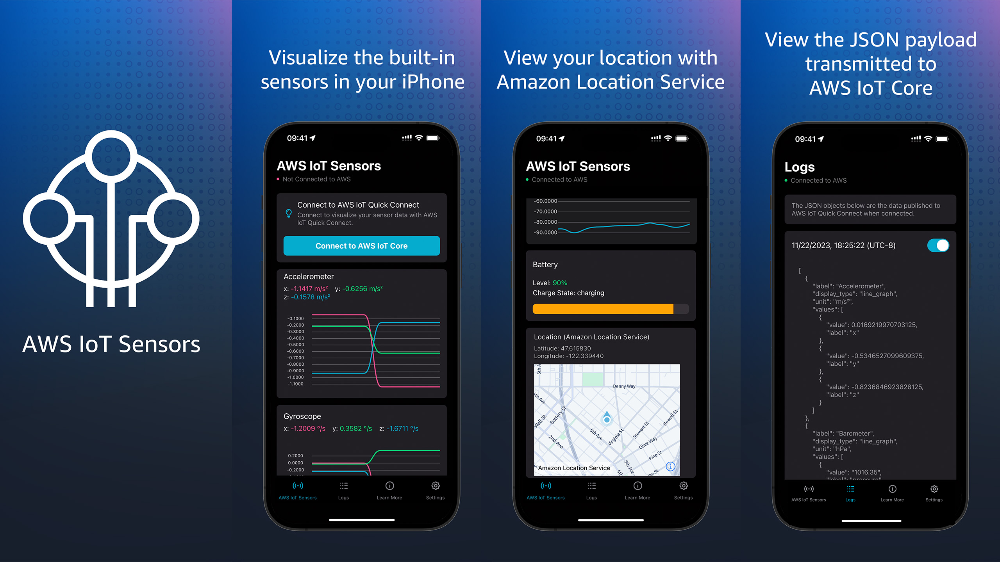

## AWS IoT Sensors

This repository provides sample code to help customers easily connect to AWS IoT Core and learn more about how the AWS IoT Sensors mobile app publishes sensor data from mobile phones to AWS. 

AWS IoT Sensors is a mobile app available on the [Apple App Store](https://apps.apple.com/app/id6447531633) and [Google Play](https://play.google.com/store/apps/details?id=com.amazon.aws.awsiotsensors).

Scan the QR code to download the app.

AWS IoT Sensors enables you to easily collect, and visualize data from sensors on your mobile device using [AWS IoT Core](https://aws.amazon.com/iot-core/) and related services like [Amazon Location Service](https://aws.amazon.com/location/). With a single click, you can start streaming sensor data from your mobile device to AWS IoT Core and view real-time visualizations in the app and on a web dashboard.

AWS IoT Sensors supports built-in sensors, including accelerometer, gyroscope, magnetometer, barometer, and GPS. It provides a frictionless way for you to use AWS IoT Core without needing an AWS account, credit card, or prior AWS or IoT experience. The app is designed for ease-of-use and to showcase how AWS IoT can be leveraged to collect, process, and visualize sensor data for IoT applications.

## Screenshots

## Security

See [CONTRIBUTING](CONTRIBUTING.md#security-issue-notifications) for more information.

## License

This library is licensed under the MIT-0 License. See the LICENSE file.

